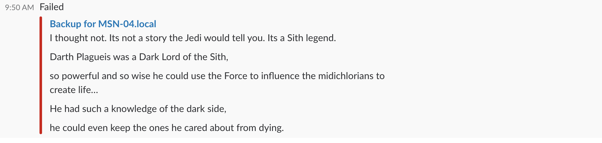

# The Webhook experience on Slack
An example of how to send logs from a file using the Slack Webhook whenever it has succeed or failed based on a string.

It gets a lot of errors when you use a variable inside the curl, that's why making the replace with `printf` before passing it to the curl, doesn't make it explode.

Using the colors you can add an awesome effect for the messages. For example:
 
Searching in the last ten lines of the "important.log" the word `midichlorians` will send to Slack:

Searching in the last ten lines of the "important.log" the word `gundam` will send to Slack:

 

In both cases the text send it to Slack it will be the last ten lines for ehm debbuging purpose or something like that.
